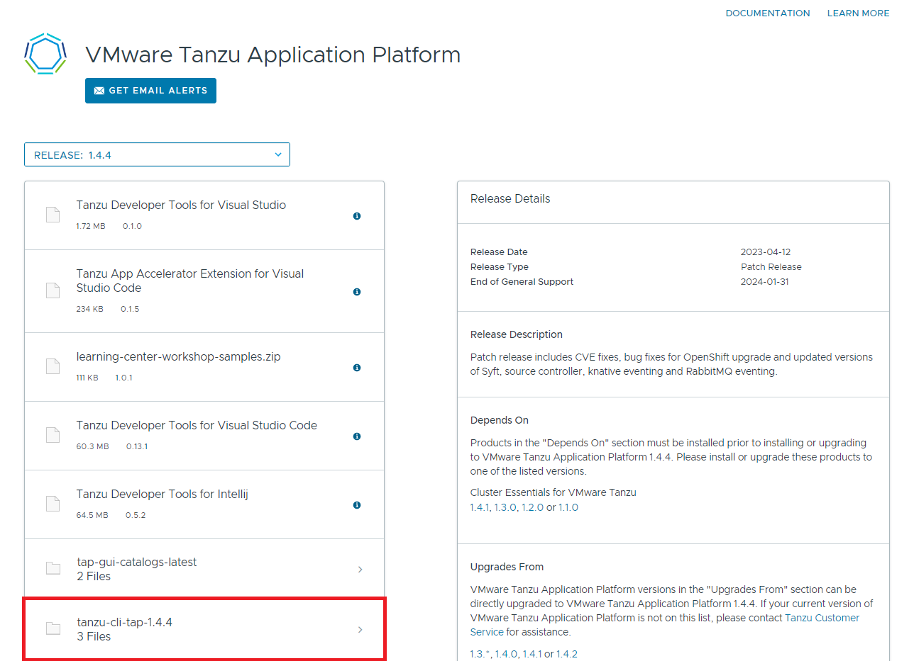
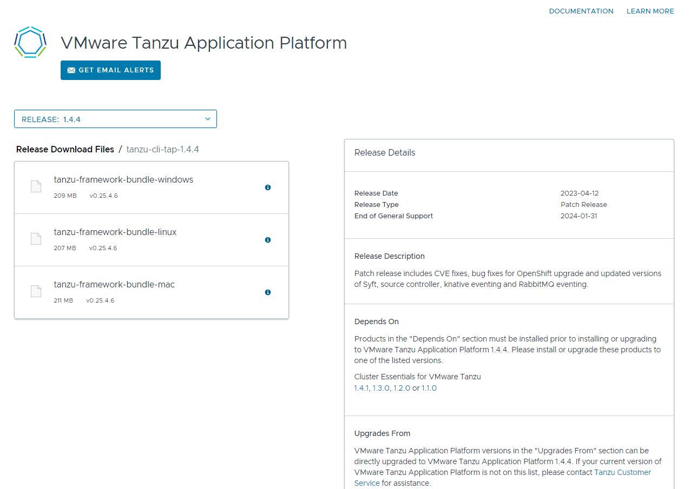
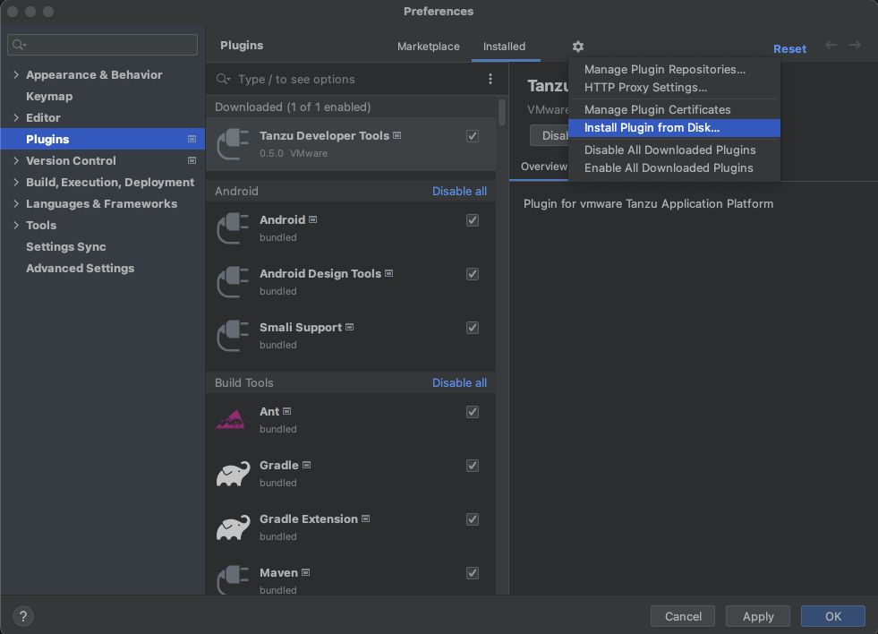
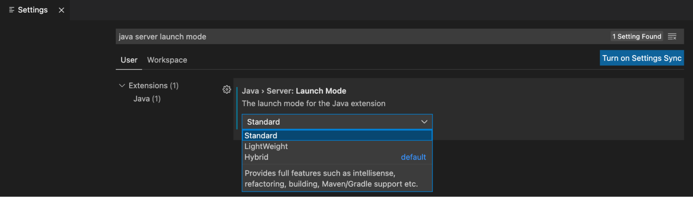
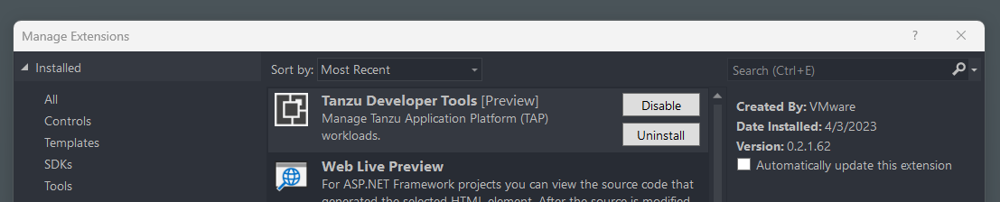

# Setup Developer Environment for working with TAP
<!-- TOC -->
* [Setup Developer Environment for working with TAP](#setup-developer-environment-for-working-with-tap)
  * [Steps](#steps)
    * [1. Install Docker](#1-install-docker)
        * [a. Install](#a-install)
        * [b. Verify](#b-verify)
    * [2. Install Tanzu CLI v1.4](#2-install-tanzu-cli-v14)
        * [a. Fetch `.tar.gz`](#a-fetch-targz)
        * [b. Untar](#b-untar)
        * [c. Install CLI](#c-install-cli)
        * [d. Verify](#d-verify)
        * [e. Plugins](#e-plugins)
    * [2. Install `kubectl`](#2-install-kubectl)
        * [a. Install](#a-install)
        * [b. Configure](#b-configure)
        * [c. Verify](#c-verify)
    * [3. Install `Tilt`](#3-install-tilt)
        * [a. Install](#a-install)
        * [b. Verify](#b-verify)
    * [4. Install IDE plugins](#4-install-ide-plugins)
        * [a. Sign in to Tanzu Network](#a-sign-in-to-tanzu-network)
        * [a. Download the plugin for your IDE](#a-download-the-plugin-for-your-ide)
        * [b. Install](#b-install)
<!-- TOC -->

## Steps
### 1. Install Docker
##### a. Install
Please install the relevant Docker for your machine: 
```bash
https://docs.docker.com/engine/install/
```
##### b. Verify
```bash
docker version
```
**output**
```bash
Client: Docker Engine - Community
 Cloud integration: v1.0.31      
 Version:           20.10.24     
 API version:       1.41         
 Go version:        go1.19.7
 Git commit:        297e128
 Built:             Tue Apr  4 18:21:00 2023
 OS/Arch:           linux/amd64
 Context:           default
 Experimental:      true

Server: Docker Desktop
 Engine:
  Version:          20.10.24
  API version:      1.41 (minimum version 1.12)
  GitCommit:        v1.1.4-0-g5fd4c4d
 docker-init:
  Version:          0.19.0
  GitCommit:        de40ad0
```
---

### 2. Install Tanzu CLI v1.4
##### a. Fetch `.tar.gz`
**Accept EULA** and download the CLI tar file under `tanzu-cli-tap`:
- https://network.tanzu.vmware.com/products/tanzu-application-platform/




Or use `pivnet` CLI:
```bash
pivnet download-product-files --product-slug='tanzu-application-platform' --release-version='1.5.0-rc.8' --product-file-id=1446073
```
**output**
```bash
2023/04/03 10:24:34 Downloading 'tanzu-framework-linux-amd64-v0.28.1.1.tar' to 'tanzu-framework-linux-amd64-v0.28.1.1.tar' 209.12 MiB / 209.12 MiB [========================================] 100.00% 1m0s
2023/04/03 10:25:35 Verifying SHA256
2023/04/03 10:25:37 Successfully verified SHA256
```
Verify
```bash
ll
```
**output**
```bash
total 214168
drwxrwxrwx 1 guyb guyb       512 Apr  3 10:26 ./
drwxrwxrwx 1 guyb guyb       512 Apr  3 09:37 ../
-rwxrwxrwx 1 guyb guyb 219277964 Apr  3 10:25 tanzu-framework-linux-amd64-v0.28.1.1.tar*
```
##### b. Untar
```bash
# Create a temporary directory
TANZU_TMP_DIR=/tmp/tanzu
mkdir -p "$TANZU_TMP_DIR"

tar -xvf "tanzu-framework-linux-amd64-v0.28.1.1.tar" -C "$TANZU_TMP_DIR"
```
**output**
```bash
cli/
cli/core/
cli/core/v0.28.1/
cli/distribution/linux/amd64/cli/accelerator/v1.5.0/
cli/distribution/linux/amd64/cli/accelerator/v1.5.0/tanzu-accelerator-linux_amd64
cli/distribution/linux/amd64/cli/external-secrets/
cli/distribution/linux/amd64/cli/external-secrets/v0.1.0-beta.4/
cli/distribution/linux/amd64/cli/external-secrets/v0.1.0-beta.4/tanzu-external-secrets-linux_amd64
cli/distribution/linux/amd64/cli/telemetry/
cli/distribution/linux/amd64/cli/telemetry/v0.28.1/
cli/distribution/linux/amd64/cli/telemetry/v0.28.1/tanzu-telemetry-linux_amd64
cli/distribution/linux/amd64/cli/package/
cli/distribution/linux/amd64/cli/package/v0.28.1/
cli/distribution/linux/amd64/cli/package/v0.28.1/tanzu-package-linux_amd64
cli/distribution/linux/amd64/cli/apps/
cli/distribution/linux/amd64/cli/apps/v0.11.1/
cli/distribution/linux/amd64/cli/apps/v0.11.1/tanzu-apps-linux_amd64
cli/distribution/linux/amd64/cli/secret/
cli/distribution/linux/amd64/cli/secret/v0.28.1/                        
cli/distribution/linux/amd64/cli/secret/v0.28.1/tanzu-secret-linux_amd64
cli/distribution/linux/amd64/cli/insight/
cli/distribution/linux/amd64/cli/insight/v1.5.0/
cli/distribution/linux/amd64/cli/insight/v1.5.0/tanzu-insight-linux_amd64
cli/distribution/linux/amd64/cli/services/
cli/distribution/linux/amd64/cli/services/v0.6.0/
cli/distribution/linux/amd64/cli/services/v0.6.0/tanzu-services-linux_amd64
cli/discovery/
cli/discovery/standalone/
cli/discovery/standalone/external-secrets.yaml
cli/discovery/standalone/apps.yaml
cli/discovery/standalone/services.yaml
cli/discovery/standalone/secret.yaml
cli/discovery/standalone/insight.yaml
cli/discovery/standalone/package.yaml
cli/discovery/standalone/accelerator.yaml
```
##### c. Install CLI
```bash
#Install CLI
export TANZU_CLI_NO_INIT=true
export TANZU_FRAMEWORK_VERSION=v0.28.1 # found under /cli/core/${VERSION}
sudo install "$TANZU_TMP_DIR/cli/core/$TANZU_FRAMEWORK_VERSION/tanzu-core-linux_amd64" /usr/local/bin/tanzu

# Install plugins
tanzu plugin install --local "$TANZU_TMP_DIR/cli" all
```
**output**
```bash
ℹ  Installing plugin 'accelerator:v1.5.0'
ℹ  Installing plugin 'apps:v0.11.1'
ℹ  Installing plugin 'external-secrets:v0.1.0-beta.4'
ℹ  Installing plugin 'insight:v1.5.0'
ℹ  Installing plugin 'package:v0.28.1'
ℹ  Installing plugin 'secret:v0.28.1'
ℹ  Installing plugin 'services:v0.6.0'
✔  successfully installed all plugins
```
##### d. Verify
CLI version
```bash
tanzu version
```
**output**
```bash
Warning, Masking commands for plugins "package, secret" because a core command or other plugin with that name already exists. 
version: v0.28.1
buildDate: 2023-03-07
```
##### e. Plugins
```bash
tanzu plugin list
tanzu init
```
**output**
```bash
Standalone Plugins
  NAME                DESCRIPTION                                                        TARGET      DISCOVERY  VERSION        STATUS     
  accelerator         Manage accelerators in a Kubernetes cluster                                               v1.5.0         installed
  apps                Applications on Kubernetes                                                                v0.11.1        installed
  external-secrets    interacts with external-secrets.io resources                                              v0.1.0-beta.4  installed
  insight             post & query image, package, source, and vulnerability data                               v1.5.0         installed
  isolated-cluster    isolated-cluster operations                                                    default    v0.28.1        installed
  login               Login to the platform                                                          default    v0.28.1        installed
  pinniped-auth       Pinniped authentication operations (usually not directly invoked)              default    v0.28.1        installed
  services            Commands for working with service instances, classes and claims                           v0.6.0         installed
  management-cluster  Kubernetes management-cluster operations                           kubernetes  default    v0.28.1        installed
  package             Tanzu package management                                           kubernetes  default    v0.28.1        installed
  secret              Tanzu secret management                                            kubernetes  default    v0.28.1        installed
  telemetry           Configure cluster-wide telemetry settings                          kubernetes  default    v0.28.1        installed
```

---

### 2. Install `kubectl`
##### a. Install
```bash
# get binary
curl -LO https://dl.k8s.io/release/v1.24.0/bin/linux/amd64/kubectl

# install
sudo install -o root -g root -m 0755 kubectl /usr/bin/kubectl
```

##### b. Configure
Configure `kubectl` to work with iteration cluster and developer namespace.
```bash
kubectl config set-context ${CLUSTER_NAME}
kubectl config set-context --current --namespace ${DEVELOPER_NAMESPACE}
```

##### c. Verify
```bash
kubectl version --short
```
**output**
```bash
Client Version: v1.25.4
Kustomize Version: v4.5.7
Server Version: v1.24.9+vmware.1
```

---

### 3. Install `Tilt`
- ref: https://docs.tilt.dev/install.html#linux

##### a. Install
**Linux**
```bash
curl -fsSL https://raw.githubusercontent.com/tilt-dev/tilt/master/scripts/install.sh | bash
```

**Windows**
```bash
kubectl config use-context docker-desktop

iex ((new-object net.webclient).DownloadString('https://raw.githubusercontent.com/tilt-dev/tilt/master/scripts/install.ps1'))
```

**Directly from GitHub**
```bash
https://github.com/tilt-dev/tilt/releases/tag/v0.32.0```
```

##### b. Verify
```bash
tilt version
```
**output**
```bash
v0.32.1, built 2023-04-14
```
---
### 4. Install IDE plugins

Refs:
- **Intellij**: https://docs.vmware.com/en/VMware-Tanzu-Application-Platform/1.5/tap/intellij-extension-install.html
- **VS Code**: https://docs.vmware.com/en/VMware-Tanzu-Application-Platform/1.5/tap/vscode-extension-install.html
- **Visual Studio**: https://docs.vmware.com/en/VMware-Tanzu-Application-Platform/1.5/tap/vs-extension-install.html

##### a. Sign in to Tanzu Network
Sign in using your VMware Tanzu Network credentials and accept EULA if you haven't already.
- URL: https://network.tanzu.vmware.com/products/tanzu-application-platform/

##### a. Download the plugin for your IDE
Download Tanzu IDE plugin from: https://network.tanzu.vmware.com/products/tanzu-application-platform/#/releases/1283644

For **TAP v1.5:**
- **Intellij**
  - `Tanzu Developer Tools for Intellij`: https://network.tanzu.vmware.com/api/v2/products/tanzu-application-platform/releases/1283005/product_files/1463761/download
  - `Tanzu App Accelerator Extension for intellij`: https://network.tanzu.vmware.com/api/v2/products/tanzu-application-platform/releases/1283005/product_files/1445920/download
- **Visual Studio Code**
  - `Tanzu Developer Tools for Visual Studio Code`: https://network.tanzu.vmware.com/api/v2/products/tanzu-application-platform/releases/1283005/product_files/1463764/download
  - `Tanzu App Accelerator Extension for Visual Studio Code`: https://network.tanzu.vmware.com/api/v2/products/tanzu-application-platform/releases/1283005/product_files/1443264/download
- **Visual Studio**
  - `Tanzu Developer Tools for Visual Studio`: https://network.tanzu.vmware.com/api/v2/products/tanzu-application-platform/releases/1283005/product_files/1464804/download


##### b. Install 
- **Intellij**
  1. Open Itellij.
  2. Open the `Preferences` pane and then go to `Plugins`.
  3. Click the gear (settings) icon and then click `Install Plugin from disk…`.
  4. Use the file picker to select the ZIP files downloaded from the VMware Tanzu Network.
  

     
- **VS Code**
  1. Open VS Code.
  2. Press cmd+shift+P to open the Command Palette and run `Extensions: Install from VSIX....`.
  3. Select the files downloaded from the VMware Tanzu Network.
  4. (Dependencies) f you do not have the following extensions, and they do not automatically install, install them from VS Code Marketplace:
     - Debugger for Java: https://marketplace.visualstudio.com/items?itemName=vscjava.vscode-java-debug
     - Language Support for Java(™) by Red Hat: https://marketplace.visualstudio.com/items?itemName=redhat.java
     - YAML: https://marketplace.visualstudio.com/items?itemName=redhat.vscode-yaml
  5. Ensure Language Support for Java is running in Standard Mode. You can configure it in the `Settings` menu by going to `Code > Preferences > Settings` under `Java > Server: Launch Mode`.
  


- **Visual Studio**
  1. Double-click the .vsix install file and click through the prompts.
  2. Open Visual Studio and, from top menu, click `Extensions > Manage Extensions`.
  3. Verify that the extension is installed and that it is the version you want.
  

