# Git Cherry-Pick Promotion for GitOps Continuous Deployment in Mono-Repo Approach

<!-- TOC -->
* [Scenario 1: Promotion](#scenario-1--promotion)
  * [Use-Case: Promote a Single Service](#use-case--promote-a-single-service)
  * [Git Flow Diagram](#git-flow-diagram)
    * [a. Overview](#a-overview)
      * [1. Create 'commit-branch' from 'target-branch'](#1-create--commit-branch-from--target-branch)
      * [2. Cherry-pick promotion from 'source-branch' to 'commit-branch'](#2-cherry-pick-promotion-from--source-branch-to--commit-branch)
      * [3. Open Pull/Merge Request from 'commit-branch' to 'target-branch'](#3-open-pullmerge-request-from--commit-branch-to--target-branch)
    * [b. Diagram](#b-diagram)
    * [c. Script](#c-script)
    * [d. Output](#d-output)
* [Scenario 2: Revert](#scenario-2--revert)
  * [Use-Case: Revert a Single Service to Previous Version](#use-case--revert-a-single-service-to-previous-version)
  * [Git Flow Diagram](#git-flow-diagram)
    * [a. Overview](#a-overview)
      * [1. Create 'commit-branch' from 'target-branch'](#1-create--commit-branch-from--target-branch)
      * [2. Checkout desired manifest to desired commit in 'commit-branch'](#2-checkout-desired-manifest-to-desired-commit-in--commit-branch)
      * [3. Open Pull/Merge Request from 'commit-branch' to 'target-branch'](#3-open-pullmerge-request-from--commit-branch-to--target-branch)
    * [b. Diagram](#b-diagram)
    * [c. Script](#c-script)
    * [d. Output](#d-output)
<!-- TOC -->

# Scenario 1: Promotion

## Use-Case: Promote a Single Service
This use case deals with promotion of a single service from 'source-branch' to 'target-branch' without promoting changes for other services ('Cherry-Pick CD').

## Git Flow Diagram

### a. Overview

##### 1. Create 'commit-branch' from 'target-branch'

Create a new branch ('commit-branch') from 'target-branch' to cherry-pick a candidate commit for promotion.

##### 2. Cherry-pick promotion from 'source-branch' to 'commit-branch'

Cherry-pick the desired commit from 'source-branch' to 'commit-branch' before opening a Pull/Merge Request in Git.

##### 3. Open Pull/Merge Request from 'commit-branch' to 'target-branch'

Automate Pull/Merge Request creation to allow manual reviewing of the code being promoted/reverted.

### b. Diagram

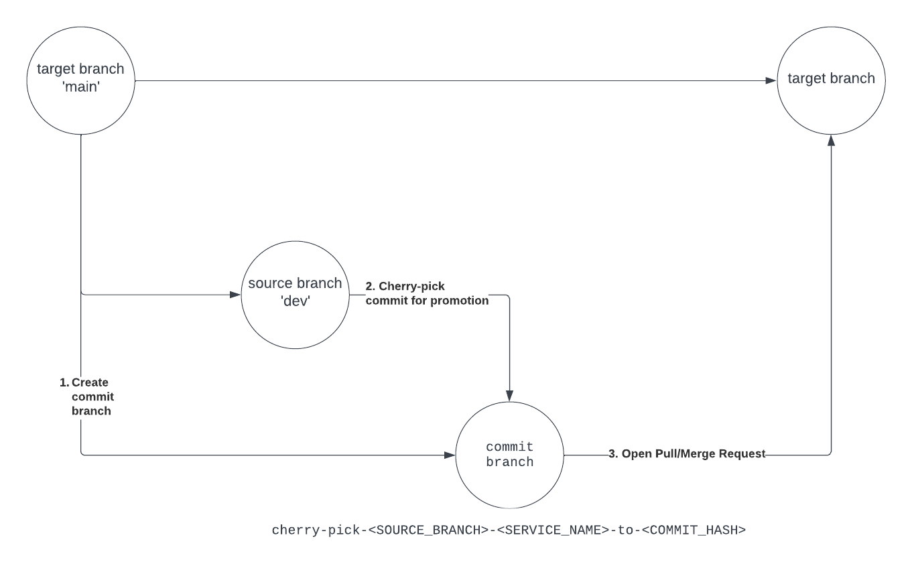

### c. Script

```bash
#!/usr/bin/env bash
SERVICE_NAME="service-b"
GITLAB_TOKEN="my-token"
SOURCE_BRANCH="dev"
TARGET_BRANCH="main"
MANIFEST_PATH="${SERVICE_NAME}.yaml"

mkdir tmp-gitops
cd tmp-gitops

git clone https://gitlab.com/guybalmas/tap-gitops.git \
&& cd tap-gitops \
&& git checkout $SOURCE_BRANCH

COMMIT_HASH=$(git log --oneline $MANIFEST_PATH | head -1 | cut -d " " -f1 | sed -z '$ s/\n$//')
COMMIT_BRANCH="cherry-pick-${SOURCE_BRANCH}-${SERVICE_NAME}-to-${COMMIT_HASH}"

echo "Commit Hash: ${COMMIT_HASH}"
echo "Commit Branch: ${COMMIT_BRANCH}"

git checkout ${TARGET_BRANCH} \
&& git branch ${COMMIT_BRANCH} \
&& git checkout ${COMMIT_BRANCH} \
&& git cherry-pick ${COMMIT_HASH}

git push -u origin ${COMMIT_BRANCH}

jx-scm pull-request create \
  --kind "gitlab" \
  --server "https://gitlab.com" \
  --owner "my-gitops-repo-owner" \
  --name "tap-gitops" \
  --head ${COMMIT_BRANCH} \
  --title "Promote ${SERVICE_NAME} Cherry Pick ${SOURCE_BRANCH} to ${TARGET_BRANCH}" \
  --body "cherry-pick promotion of ${SERVICE_NAME} commit: [${COMMIT_HASH}] is ready for review" \
  --base ${TARGET_BRANCH} \
  --token ${GITLAB_TOKEN} \
  --username "my-git-user"

rm -rf ../../tmp-gitops
```

### d. Output

**GitLab**
```bash
created pull request #1 in repo 'guybalmas/tap-gitops'. url: https://gitlab.com/guybalmas/tap-gitops/-/merge_requests/1
```
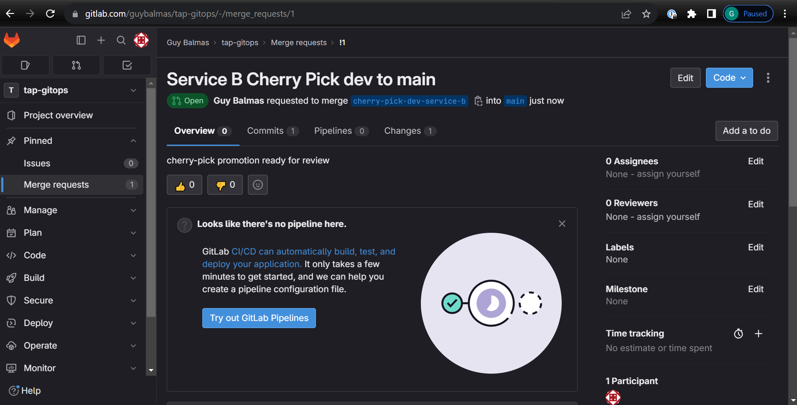

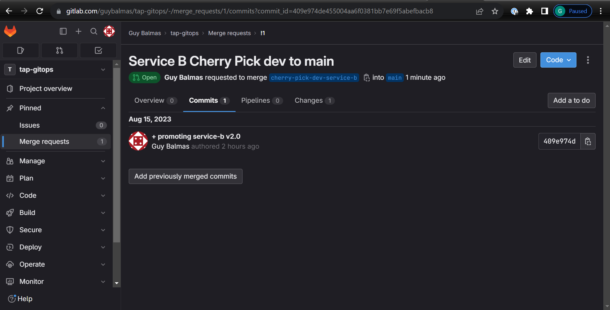

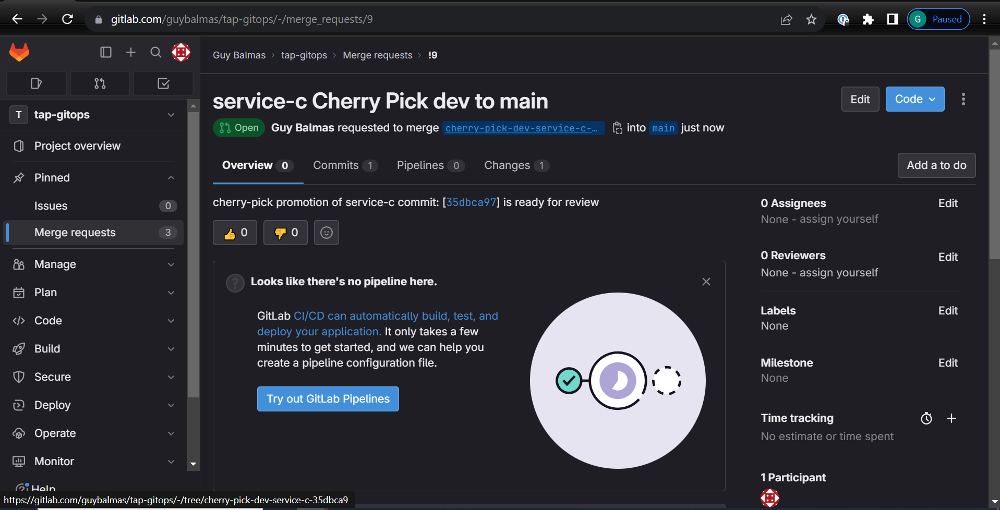

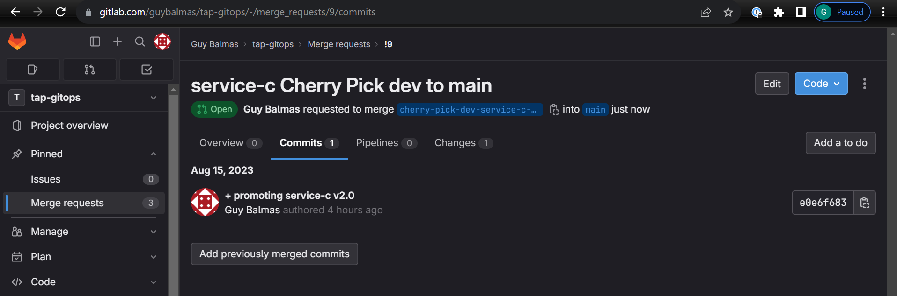


# Scenario 2: Revert

## Use-Case: Revert a Single Service to Previous Version

This use case deals with reverting a single service in 'target-branch' branch, without reverting changes for other services ('Cherry-Pick Revert').

## Git Flow Diagram

### a. Overview

##### 1. Create 'commit-branch' from 'target-branch'

Create a new branch ('commit-branch') from 'target-branch' to revert the desired manifest in.

##### 2. Checkout desired manifest to desired commit in 'commit-branch'

Checkout the desired manifest in 'commit-branch' to the desired commit from 'target-branch' before opening a Pull/Merge Request in Git.

##### 3. Open Pull/Merge Request from 'commit-branch' to 'target-branch'

Automate Pull/Merge Request creation to allow manual reviewing of the code being promoted/reverted.

### b. Diagram

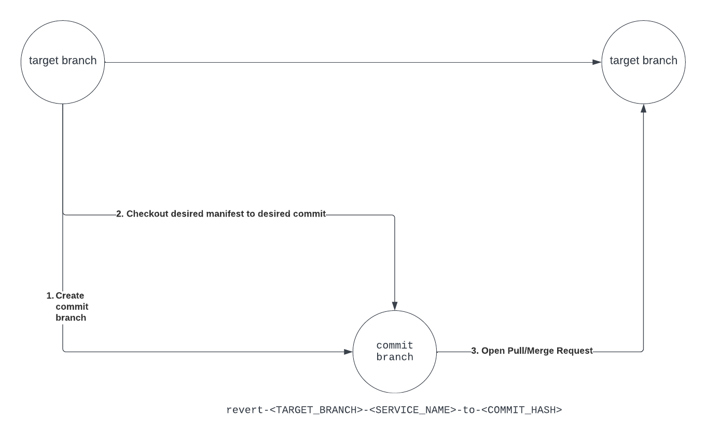

### c. Script

```bash
#!/usr/bin/env bash
SERVICE_NAME="service-b"
GITLAB_TOKEN=""
TARGET_BRANCH="main"
MANIFEST_PATH="${SERVICE_NAME}.yaml"

mkdir tmp-gitops \
&& cd tmp-gitops

git clone https://gitlab.com/guybalmas/tap-gitops.git \
&& cd tap-gitops \
&& git checkout $TARGET_BRANCH

COMMIT_HASH=$(git log --oneline $MANIFEST_PATH | head -2 | sed -n 2p | cut -d " " -f1 | sed -z '$ s/\n$//')
COMMIT_BRANCH="revert-${TARGET_BRANCH}-${SERVICE_NAME}-to-${COMMIT_HASH}"

echo "Commit Hash: ${COMMIT_HASH}"
echo "Commit Branch: ${COMMIT_BRANCH}"

git branch ${COMMIT_BRANCH} \
&& git checkout ${COMMIT_BRANCH} \
&& git checkout ${COMMIT_HASH} -- ${MANIFEST_PATH} \
&& git commit -m "Reverted to commit: [${COMMIT_HASH}]"

git push -u origin ${COMMIT_BRANCH}

jx-scm pull-request create \
  --kind "gitlab" \
  --server "https://gitlab.com" \
  --owner "my-gitops-repo-owner" \
  --name "tap-gitops" \
  --head ${COMMIT_BRANCH} \
  --title "Revert ${SERVICE_NAME} in ${TARGET_BRANCH} to ${COMMIT_HASH}" \
  --body "Revert of ${SERVICE_NAME} commit: [${COMMIT_HASH}] is ready for review" \
  --base ${TARGET_BRANCH} \
  --token ${GITLAB_TOKEN} \
  --username "my-git-username"

rm -rf ../../tmp-gitops
```


### d. Output

**GitLab**
```bash
created pull request #11 in repo 'guybalmas/tap-gitops'. url: https://gitlab.com/guybalmas/tap-gitops/-/merge_requests/11
```

**GitLab**

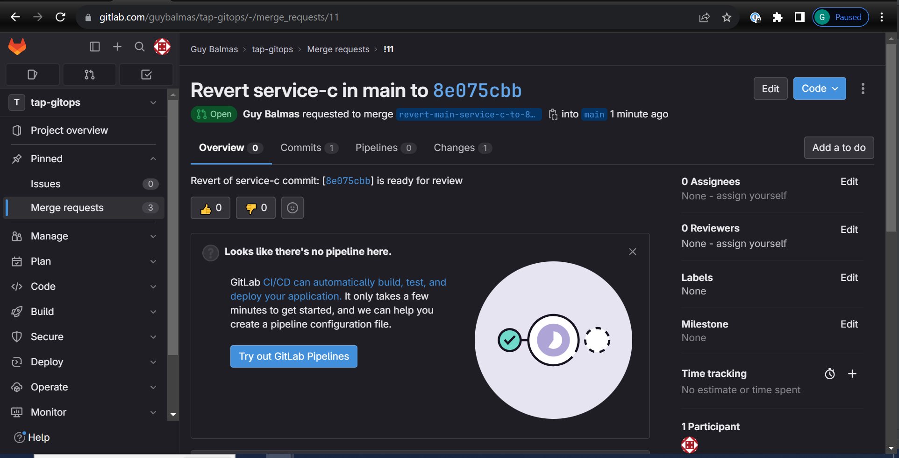

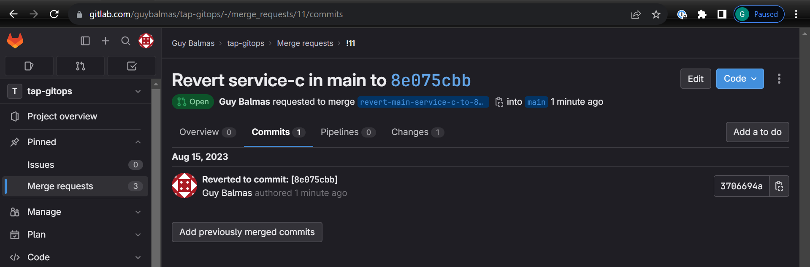

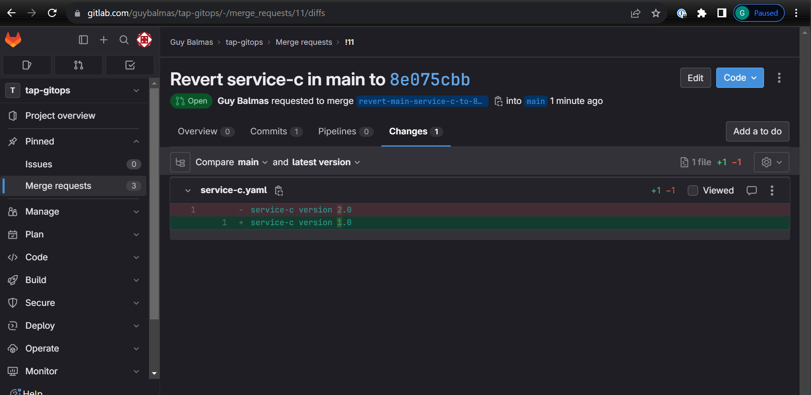

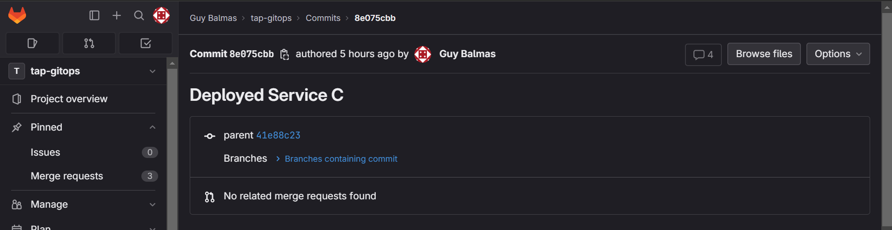

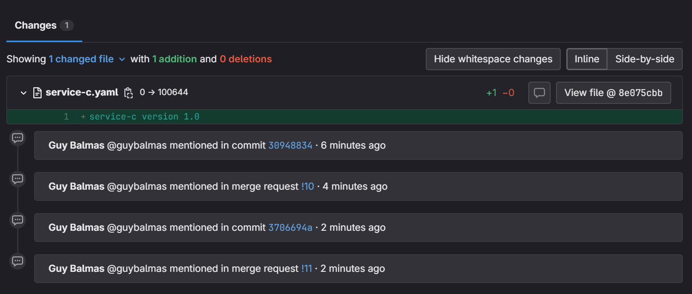

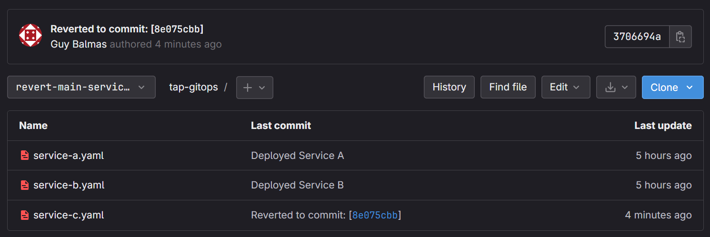

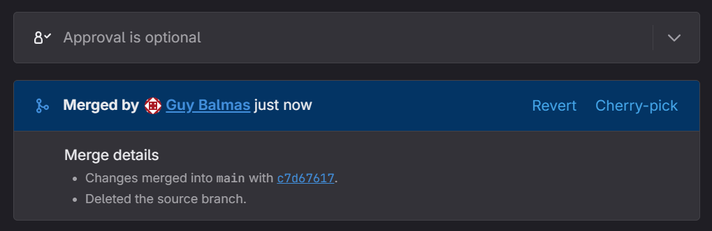

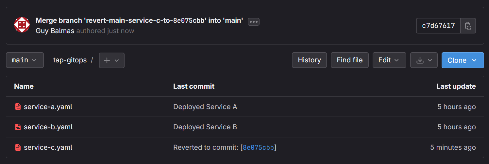
